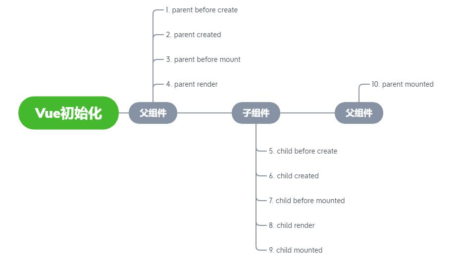

vue 是构建用户界面的渐进式框架

### keepalive

组件内部维护 cache,keys 两个变量进行缓存对象读取，如果缓存对象存在该组件实例，读取后将该实例推至队列末尾。否则存储该实例。
同时 watch，include/exclude 的变化，实时更新 cache，keys。内部使用 pruneCacheEntry 的$destoryed 方法销毁缓存 vnode

### v-if v-show

v-if 操作 dom
v-show css display:block, none

### v-for key

列表数据庞大，列表增删改查时导致重新渲染，导致内存浪费，用唯一的 key 标记 vnode，可以快速定位并且重新渲染修改项，其他数据就地复用。提高性能。

- 为什么不用数组下标作为 key
  当进行插入操作时，不仅当前插入项下标变化，之后的所有项下标都变化了，引起了不必要的渲染。

### vue 生命周期

2 初始化 2 挂载 2 更新 2 卸载 2keepalive 激活失活 1 错误捕捉

### vue 挂载

父子组件

可以看到父组件在渲染完成之后并不是马上挂载，而是先等待子组件创建、渲染、挂载完成之后再去挂载。

[vue 挂载原理](https://blog.csdn.net/qq_39816673/article/details/104323156)
完整版本：包括编译器，使用 template，compileToFunctions，使用模版编译
运行版本：不包括编译器，使用 render 函数

```javascript
var mount = Vue.prototype.$mount;
Vue.prototype.$mount = function (el, hydrating)){
    ....// 函数劫持,原型上的$mount方法保存在mount属性上，然后原型上重新定义一个$mount方法
        //通过这种方式就可以在执行原有方法之前新增一些功能
    return mount.call(this,el, hydrating))
}
```

compileToFunctions 主要是把模板编译成渲染函数并设置到 this.$options 上
模版编译：解析器，优化器，代码生成器。
解析器主要是将模板解析成 AST，优化器主要是遍历 AST 标记静态节点，这样再虚拟 DOM 中更新节点时，就不会重新渲染它了，而代码生成器就是把 AST 转化为代码字符串，从而转换成渲染函数。

`vm._update(vm._render(), hydrating);`
\_update 作用是调用虚拟 DOM 的 patch 方法进行新旧对比，而\_render 则是生成一个新的 VNode 节点数，那么 vm.\_update(vm.\_render(), hydrating)就是将新的 VNode 和旧的 VNode 进行对比并更新 DOM

### 描述组件渲染和更新的过程

初次渲染：模版解析为 render 函数，响应式监听 data，初始化实例属性。执行 render 生成 vnode，根据 vnode 再 patch(el, vnode)渲染成真实 dom 挂载到节点。
更新过程：nofity 到视图更新到 observer，重新 render 形成新的 newVnode，patch 新旧 vnode 对比 diff 算法
异步渲染：$nextTick

### diff 算法

普通树比较算法，逐级遍历新旧节点，再排序，O(n3)
1、同层比较
2、tag 不同删掉重建，不再深层遍历
3、tag 和 key 都相同则逐级下层比较
O(n)

### 双向数据绑定 v-model 实现原理

对象挟持，
观察者模式？？？
遍历实例 data 属性，重定义实例上 Object.defineProperty，每个属性生成自己的依赖收集对象 Dep。当模版编译读到该文本节点时，建立一个关于该属性的监听者，初次读值时收集其依赖。赋值时调用遍历 dep，依次调用其观察方法

## 异步渲染

[原理](https://blog.csdn.net/qq_42072086/article/details/106986201)
当数据变化时，会调用Dep（依赖收集）里的notify方法，遍历watcher，通过调用watcher.update方法实现更新。但update方法并不会立即执行，而是将多个watcher放入queueWatcher队列中，并且去重。再通过nextTick异步执行flushScheduleWatcher刷新watcher队列。触发watcher.before(vue生命周期钩子beforeUpdate)，再执行watcher.run进行页面渲染，更新完再调用updated钩子

## computed

`computed` 有缓存，`data` 不变则不会重新计算。[computed 原理](https://www.cnblogs.com/qianxiaox/p/13704845.html)。
发布订阅模式`_computedWatchers`，遍历 `comptued` 对象，对每个计算属性进行数据劫持和依赖收集`Ojbect.defineProperty`。

## watch

监听引用类型需要深度监听`handler`,`deep`，拿不到 oldVal(此时 oldVal 和 val 指针指向同一块内存地址)

## v-for

`v-for` 优先级比 `v-if` 高，不建议一起使用，因为 for 循环每项都会执行 `v-if` 判断，性能不好

## 自定义事件

`event` 自定义事件实现跨层级通信，`new Vue()`导出 `event`，$on,$emit(观察者模式，vm.$events)，`beforeDestory` 里及时解绑自定义事件($off)

## 生命周期渲染

created, vue 实例初始化完毕，构建 vnode（js 对象）完毕，created 是从父组件->子组件。mounted 时 vnode 渲染成真实 dom，页面渲染完毕，从子组件->父组件。

## 自定义 v-model

父子组件 v-model 实现双向通信。
v-model 绑定计算属性，需要用对象，实现 get，set
`<custom-component v-model="text"></custom-component>`
custom-component.vue
`<input type="text" :value="text" @input="$emit('change',$event.target.value)"/>`

<script>
   export default{
      model: {
         prop: 'text',
         event: 'change',
      },
      props: {
         text: String,
         default(){
            return ''
         }
      }
   }
</script>

## $nextTick

1. 在 task 或者 microtask 中推入一个 timerFunc，在当前调用栈执行完以后以此执行直到执行到 timerFunc，目的是延迟到当前调用栈执行完以后执行。
2. timerFunc 一个函数指针，指向函数将被推送到任务队列中，等到主线程任务执行完时，任务队列中的 timerFunc 被调用，
3. 主要通过 Promise、MutationObserver 以及 setTimeout

## MVVM-数据驱动视图

## slot

1. 作用域插槽，slot 组件向父组件传值

## 动态（异步）组件

通过 import 加载组件，编译时加载，动态异步加载

## keep-alive

keep-alive 组件，依次遍历节点，碰到 keep-alive 组件则去匹配 exclude 和 include 的规则，命中则放入 cache 中，标记是缓存组件，否则生成正常 vnode

## mixin

合并策略，组件共同逻辑复用，缺点无法跟踪来源，不利于维护

## 组件化

## 响应式

Object.defineProperty

1. 复杂数据类型（对象）深度监听，递归计算量大
2. 无法监听新增/删除的属性（Vue.set,Vue.delete)
3. 无法监听数组的变化（push,pop 等）

## vdom

## 模版编译

1. vue template compile 将模版编译成 render 函数，插件`vue-template-compiler`
2. 执行 render 函数生成 vnode
   patch
   `const template =`<input type="text" v-model="name">
   const res = compiler.compile(template)
   with(this){return \_c('input',{directives:[{name:"model",rawName:"v-model",value:(name),expression:"name"}],attrs:{"type":"text"},domProps:{"value":(name)},on:{"input":function($event){if($event.target.composing)return;name=$event.target.value}}})}

`

## hash 路由

1. 触发网页跳转，监听浏览器前进后退，window.hashchange
2. hash 变化不会刷新页面
3. 不会提交到 server 端

## ajax 放在那个生命周期

moutend。在 created,mounted 效果都是一样的，因为 js 是单线程。ajax 是异步任务，会被浏览器放进 eventLoop 里面，都会等主线程执行完毕再执行。而放在 mouted 里面，在 dom 渲染完进行异步请求，会有比较好的语义逻辑理解。

## 如何将组件所有 props 传递给子组件
$props
